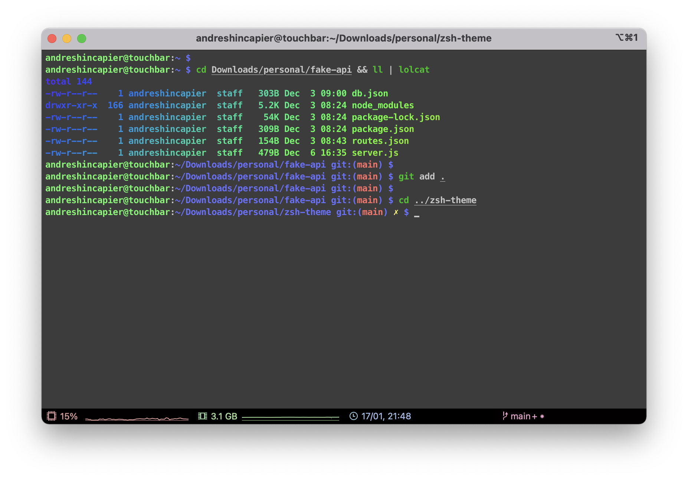

# Introduction

For users who love the look and feel of a Linux terminal, without losing the capabilities offered by the plugins offered by oh-my-zsh



## Installation

```sh
curl https://raw.githubusercontent.com/andreshincapier/zsh-theme/main/andreshir.zsh-theme -o $ZSH_CUSTOM/themes/andreshir.zsh-theme
```

### Note
If you want colorful output on your commands you can use [Lolcat](https://github.com/busyloop/lolcat)

## Usage

```sh
# Set theme
ZSH_THEME="andreshir"

# Set plugins
plugins=(git colored-man-pages colorize pip python brew macos zsh-syntax-highlighting)

source $ZSH/.oh-my-zsh.sh
```

## License

This repository is licensed under MIT License